<div align="center">

# 🏙️ Smart City Command Center

### 🚨 NYC 311 Civic Issue Tracker

### Exploratory Data Analysis using Python


<br>


</div>

---

# 🌃 Smart City Mission

> **"Every complaint tells a story. Every dataset reveals a solution."**

This project analyzes **20,000 NYC 311 Service Requests** to understand how citizens interact with city services and how efficiently complaints are resolved.

Using **Exploratory Data Analysis (EDA)**, the project uncovers trends, identifies operational bottlenecks, and generates insights that can support smarter urban planning and faster public service delivery.

---

## 🎯 Project Objectives

- 📊 Analyze 20,000 civic service requests
- 🚨 Discover the most common complaint types
- 🏙️ Compare complaint patterns across NYC boroughs
- ⏱️ Measure complaint resolution time
- 📅 Analyze daily, monthly, and hourly trends
- 📍 Study complaint distribution by city and location type
- 💡 Generate business insights for Smart City planning

---

## 📂 Dataset Overview

| Feature | Details |
|---------|---------|
| 🏙️ Dataset | NYC 311 Service Requests |
| 📦 Records | 20,000 |
| 📊 Features | 26 |
| 🧹 Data Cleaning | Completed |
| 📈 Feature Engineering | Completed |
| 🔍 Analysis Type | Exploratory Data Analysis |
| 🛠️ Tools | Python, Pandas, NumPy, Matplotlib, Seaborn |

---

## ⚡ Tech Stack

<p align="center">


</p>

---

# 🚦 EDA Workflow

```text
        📥 Raw Dataset
              │
              ▼
      🧹 Data Cleaning
              │
              ▼
   ⚙️ Feature Engineering
              │
              ▼
    📊 Univariate Analysis
              │
              ▼
     🔄 Bivariate Analysis
              │
              ▼
      💡 Business Insights
              │
              ▼
   🏙️ Smart City Decisions
```

---
# 📊 Analytics Dashboard

<p align="center">
  
  
  
  
</p>

---

# 📸 Visual Insights Gallery

## 🔹 Complaint Analysis

| Top 10 Complaint Types | Top 5 Complaint Types |
|:-----------------------:|:---------------------:|
| 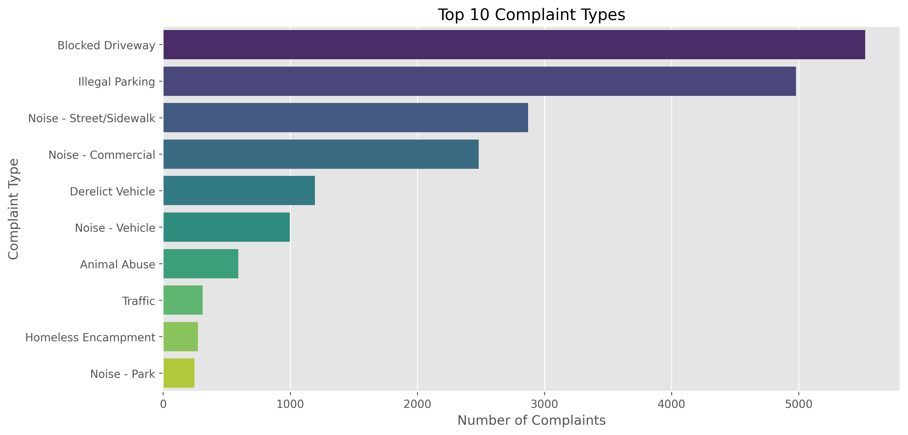 | 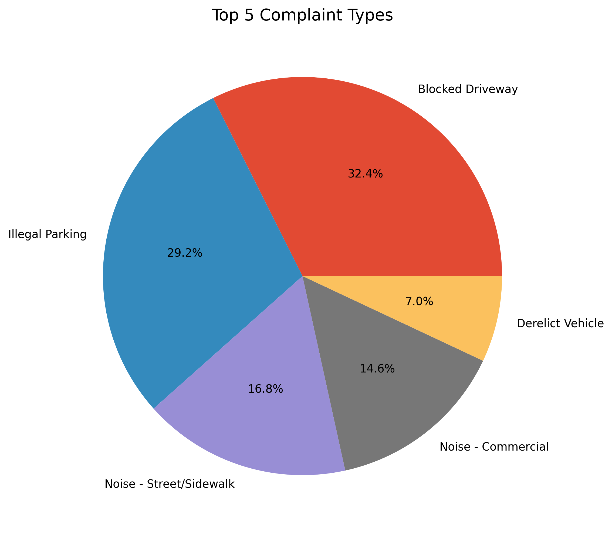 |

---

## 🔹 Complaint Distribution

| Complaints by Agency | Complaint Status |
|:--------------------:|:----------------:|
| 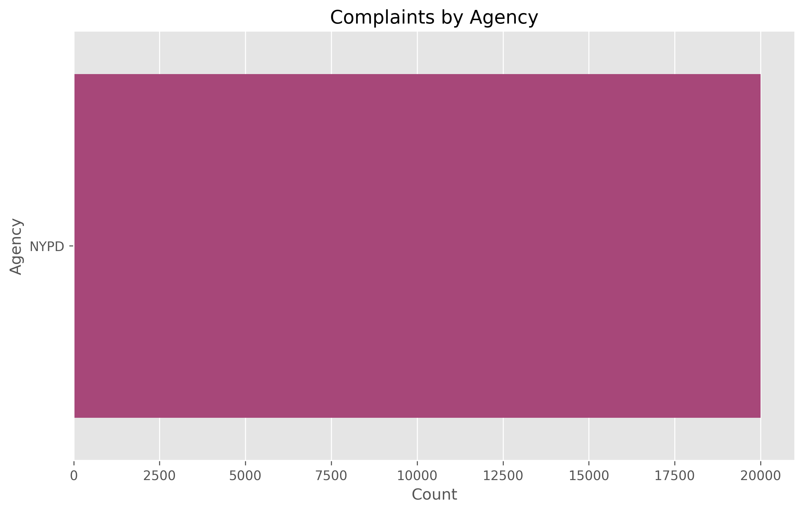 | 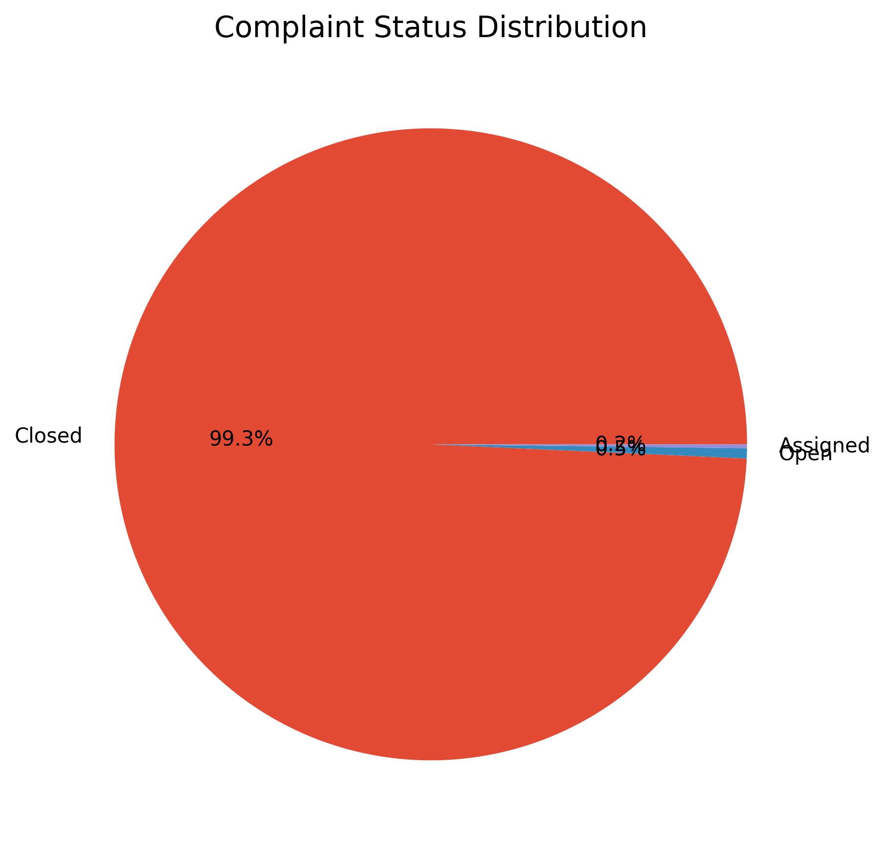 |

---

## 🔹 Resolution Analysis

| Resolution Days by Complaint Type | Resolution Days by Borough |
|:--------------------------------:|:--------------------------:|
| 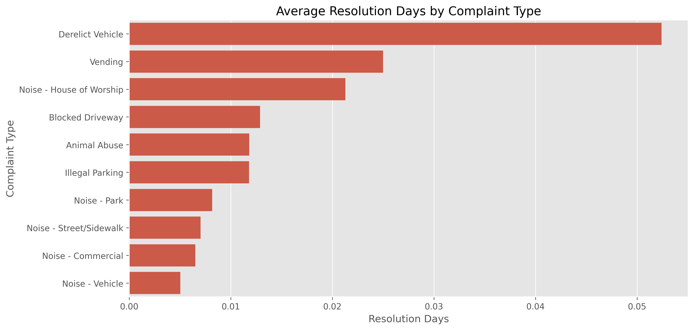 | 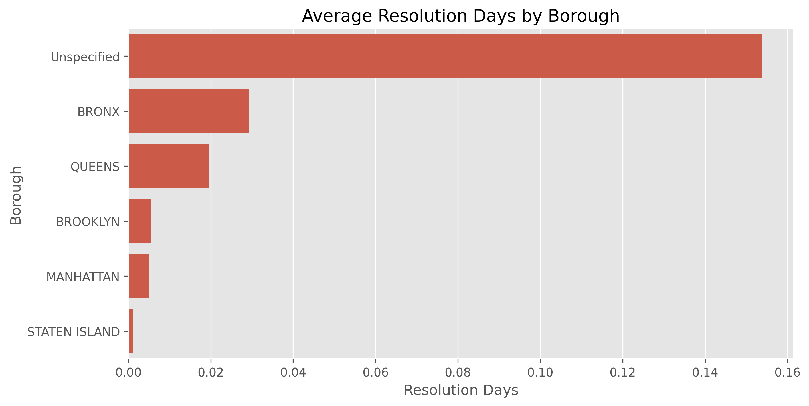 |

---

## 🔹 Time Analysis

| Hourly Complaint Trend | Complaints by Day |
|:----------------------:|:-----------------:|
| 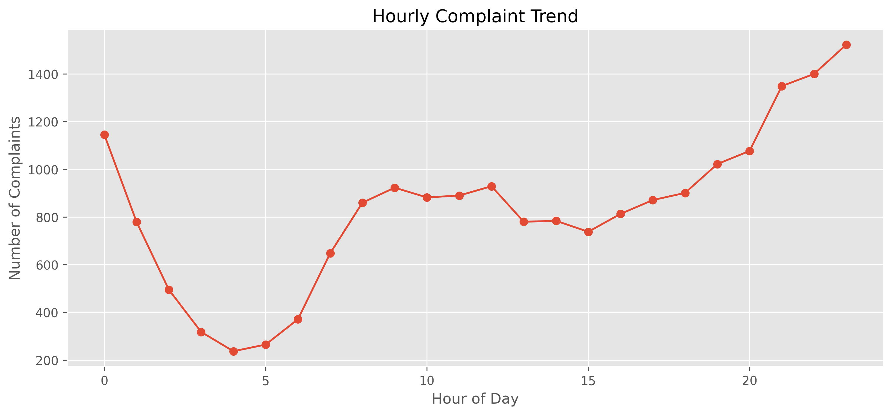 | 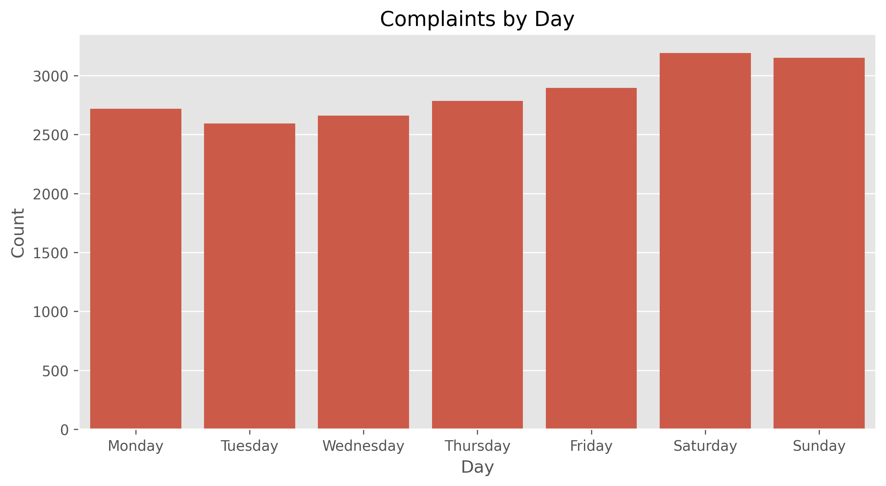 |

---

## 🔹 Geographic Analysis

| Top 10 Cities | Top Location Types |
|:-------------:|:------------------:|
| 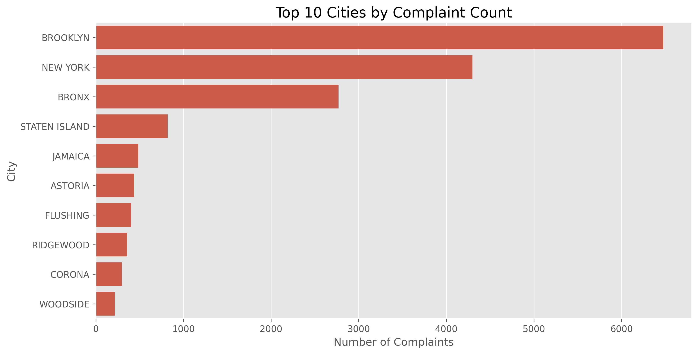 | 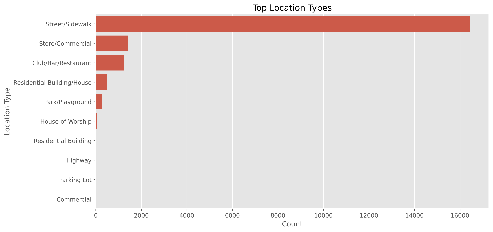 |

---

## 🔹 Additional Analysis

| Address Type Distribution | Complaint Status by Type |
|:-------------------------:|:------------------------:|
| 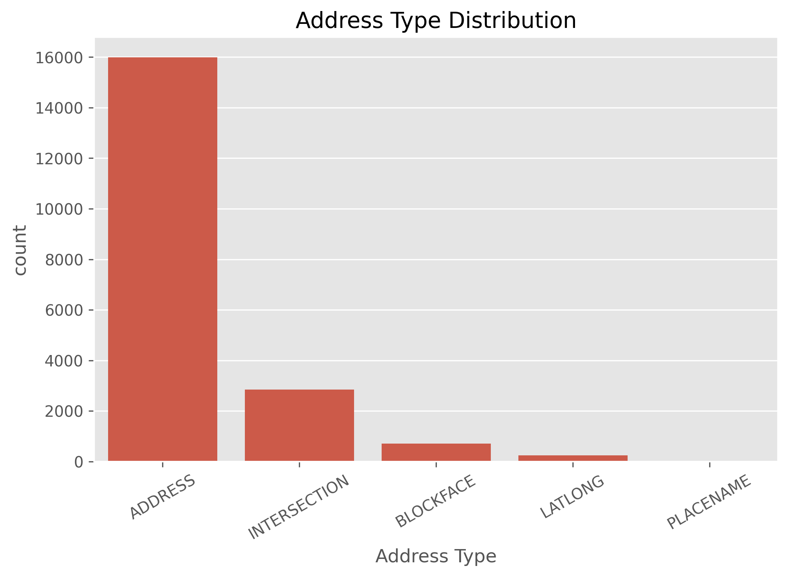 | 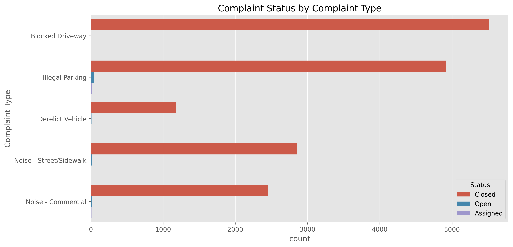 |

---

# 🔄 Project Workflow

```text
                 📥 NYC 311 Dataset
                        │
                        ▼
              🧹 Data Cleaning
                        │
                        ▼
          ⚙️ Feature Engineering
                        │
                        ▼
        📊 Univariate Analysis
                        │
                        ▼
        🔄 Bivariate Analysis
                        │
                        ▼
        💡 Business Insights
                        │
                        ▼
       🏙️ Smart City Decisions
```

---

# 📌 Project Highlights

✅ Cleaned and processed **20,000** NYC 311 service requests.

✅ Performed complete **Exploratory Data Analysis (EDA)**.

✅ Created **12+ professional visualizations** using Matplotlib and Seaborn.

✅ Identified complaint trends by complaint type, agency, city, borough, and time.

✅ Analyzed complaint resolution performance across different categories.

✅ Generated actionable business insights to support **Smart City** decision-making.

---
# 💡 Key Insights

<table>
<tr>
<td width="50%">

### 🚨 Complaint Patterns

- Noise-related complaints are among the most frequently reported.
- A small number of complaint categories contribute to a large share of all requests.
- Complaint volume varies significantly across boroughs.

</td>

<td width="50%">

### ⏱️ Resolution Performance

- Most complaints are resolved within a reasonable timeframe.
- Some complaint categories require considerably longer resolution times.
- Resolution efficiency differs across boroughs.

</td>
</tr>

<tr>
<td width="50%">

### 📍 Geographic Insights

- Complaint density is concentrated in a few major cities and boroughs.
- Certain location types generate a higher number of service requests.
- Address type also influences complaint distribution.

</td>

<td width="50%">

### 📅 Time-Based Insights

- Complaint activity changes throughout the day.
- Some days experience noticeably higher complaint volumes.
- Monthly trends reveal seasonal variations in civic issues.

</td>
</tr>
</table>

---

# 🏛️ Business Recommendations

### 🚀 Recommendation 1

Increase staff availability during peak complaint hours to reduce response delays.

---

### 🚀 Recommendation 2

Allocate additional resources to boroughs with consistently high complaint volumes.

---

### 🚀 Recommendation 3

Prioritize complaint categories with the highest average resolution time.

---

### 🚀 Recommendation 4

Implement preventive maintenance programs for frequently reported civic issues.

---

### 🚀 Recommendation 5

Develop real-time monitoring dashboards for city administrators.

---

# 📁 Project Structure

```text
Smart-City-311-Civic-Issue-Tracker/
│
├── README.md
├── 311_Civic_Issue_Tracker.ipynb
├── requirements.txt
│
├── dataset/
│   └── 311_Final_EDA.csv
│
├── images/
│   ├── top_10_complaint_types.png
│   ├── top_5_complaint_types.png
│   ├── complaints_by_agency.png
│   ├── complaint_status_distribution.png
│   ├── top_10_cities.png
│   ├── complaints_by_day.png
│   ├── hourly_complaint_trend.png
│   ├── top_location_types.png
│   ├── address_type_distribution.png
│   ├── complaint_status_by_type.png
│   ├── avg_resolution_days_by_complaint_type.png
│   └── avg_resolution_days_by_borough.png
│
└── LICENSE
```

---

# 🛠️ Installation

Clone the repository

```bash
git clone https://github.com/your-username/Smart-City-311-Civic-Issue-Tracker.git
```

Go to project directory

```bash
cd Smart-City-311-Civic-Issue-Tracker
```

Install dependencies

```bash
pip install -r requirements.txt
```

Launch Jupyter Notebook

```bash
jupyter notebook
```

Open

```text
311_Civic_Issue_Tracker.ipynb
```

---

# 📈 Future Improvements

- 🌍 Interactive Dashboard using Power BI or Tableau
- 🗺️ GIS-based complaint mapping
- 🤖 Machine Learning model for complaint prediction
- 📊 Real-time data pipeline
- ☁️ Cloud deployment with automated reporting

---

---

# 👨‍💻 About the Author

<div align="center">


### **Misari Dhorajiya**

🎓 Diploma in Information Technology (2025)

📚 Data Science | AI & Machine Learning Enthusiast

💻 Python • SQL • Power BI • Machine Learning • Exploratory Data Analysis

🚀 Passionate about solving real-world problems using data.

</div>

---

# 🌐 Connect With Me

<p align="center">

<a href="mailto: misaridhorajiya@gmail.com">

</a>

</p>

---

# 📊 Project Summary

| Metric | Value |
|--------|-------|
| 🏙️ Project | Smart City 311 Civic Issue Tracker |
| 📦 Dataset | NYC 311 Service Requests |
| 📊 Records | 20,000 |
| 🧹 Features | 26 |
| 📈 Visualizations | 12+ |
| 🛠️ Tools | Python, Pandas, NumPy, Matplotlib, Seaborn |
| 🎯 Objective | Exploratory Data Analysis |

---

# ⭐ Why This Project Matters

Modern cities receive thousands of public service requests every day.

Analyzing this information helps:

- 🚦 Improve city operations
- 🚨 Reduce complaint resolution time
- 📍 Identify high-priority locations
- 📊 Support data-driven decision making
- 🏙️ Build smarter and more efficient cities

This project demonstrates how Exploratory Data Analysis can transform raw civic data into actionable insights for urban governance.

---

# 🙏 Acknowledgements

- 📂 Kaggle for providing the NYC 311 Service Requests dataset.
- 🐍 Python open-source ecosystem.
- 📊 Pandas, NumPy, Matplotlib and Seaborn communities.

---

<div align="center">

# ⭐ If you found this project useful...

### Please consider giving it a ⭐ on GitHub!


---

### 🏙️ Smart City Analytics • Exploratory Data Analysis • Python

**Turning Civic Data into Actionable Insights**

</div>
